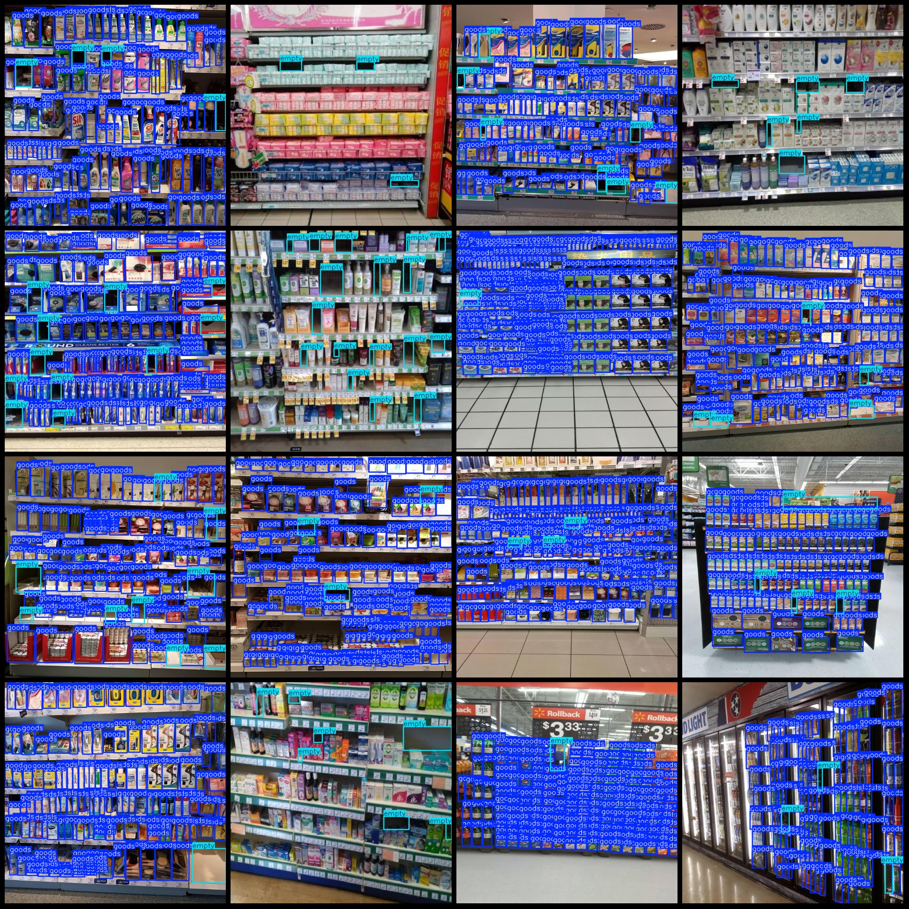
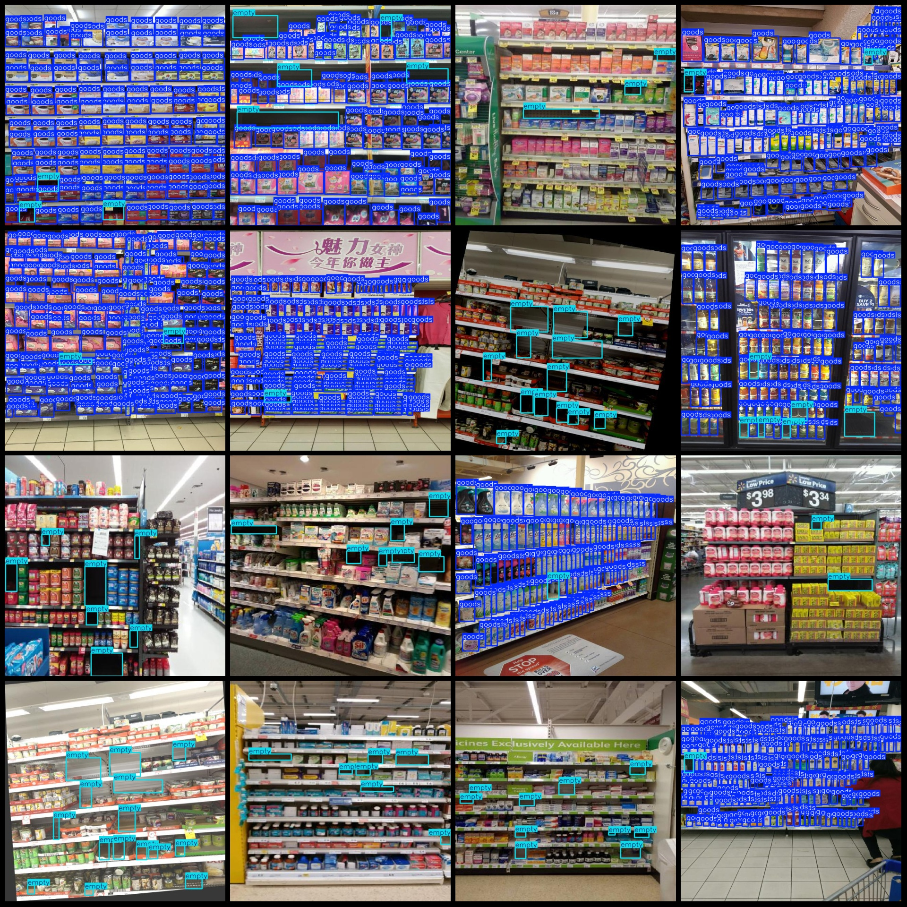

# Supermarket Shelf Item Hole Detection Dataset (VOC+YOLO) - 2709 Images in 2 Categories

Please note that the dataset contains images of items on shelves without labeled normality. The purpose of labeling is to prevent misdetection. Without labeled models, they would be trained as 
background and labeled ones can be filtered out during detection.
The dataset format follows Pascal VOC conventions plus YOLO format (txt files without split paths, only containing jpg images along with their corresponding VOC XML files and YOLO txt files).
There are 2709 jpg files in total, 2709 xml files, and 2709 txt files. There are 2 categories in the dataset: "empty" and "goods".
The number of boxes for each category:
- "empty" box count = 15721
- "goods" box count = 228488
Total box count = 244209
The number of images per category:
- "empty" images = 2642
- "goods" images = 1552
Image resolution: 640x640
Labeling tool used: labelImg
Labeling rules: Draw bounding boxes around the category.
Important note: The dataset does not have a training/validation/test split; it requires self-splitting.
Special notice: This dataset does not guarantee the accuracy of any trained models or weight files.
Picture preview:
Example of labeled image:

## IMAGE

Here is a pay link on Stripe ( https://buy.stripe.com/3cs8yP7sY87d0vu9AB ). Please contact me lonlonago@foxmail.com after funding $89, and I will send you a complete data files , thank you!

